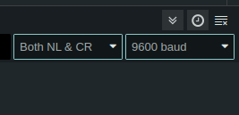
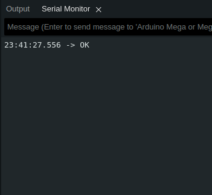

# Comunicação via Bluetooth (HC-05)

Conjunto de códigos Arduíno para realizar a comunicação sem fio usando módulos HC-05.

## Configurações

Para configurar os módulos, foi necessário antes ativar o modo AT em cada módulo. A seguinte pinagem foi utilizada:

|  HC-05  |  Arduino  |
|---------|-----------|
|  VCC    |  5V       |
|  GND    |  GND      |
|  TX     |  11 (RX)  |
|  RX     |  10 (TX) Com divisor de tensão `R1 = 1k` e `R2 = 2k`  |
|  EN     |  3.3V (Ligar apenas para modo AT)  |

Para configurar ambos os módulos, é necessário entrar em Modo AT. Para entrar neste modo, o HC-05 deve ser iniciado com o pino EN ligado na porta `3.3V` no momento em que for iniciado (não funciona se a porta for conectada depois do dispositivo acender os leds). O módulo se encontra em modo de pareamento quando os LEDs piscam de 1 em 1 segundo, enquanto no Modo AT eles piscam de 2 em 2.

Estando no Modo AT e usando o código em `AT_configurator`, deve-se configurar o monitor serial também para a comunicação. Configura-o em modo `Both NL & CR` e com o baud definido no código ao inicializar o Serial (no nosso caso, `Serial.begin(9600)`). Em Modo AT, o baud do dispositivo é sempre 38400.

Após isso, ao digitar AT no terminal e enviar, deve-se obter um `OK` como resposta. Caso isso não ocorra, algo deu errado na configuração.

|  Comando AT  |  Master  |  Slave  |
|--------------|----------|---------|
|  AT+ROLE     |  1       |  0      |
|  AT+CMODE    |  1       |  1      |
|  AT+UART     |  9600,1,0  |  9600,1,0  |
|  AT+PSWD     |  2444    |  2444   |

Com base na [Lista de comandos AT](https://s3-sa-east-1.amazonaws.com/robocore-lojavirtual/709/HC-05_ATCommandSet.pdf):

AT+ROLE:
- 0 -> Slave
- 1 -> Master
- 2 -> Slave-Loop (modo que recebe e imediatamente devolve o mesmo sinal para o Master)

AT+CMODE:
- 0 -> Conecta o módulo ao endereço especificado. (Pode ser fornecido pelo comando AT+ADDR)
- 1 -> Conecta o módulo a qualquer endereço. (AT+ADDR não tem efeito aqui)
- 2 -> Slave-Loop

AT+UART:
- Param1: baud. 
- Param2: Stop bit:
    - 0 -> 1 bit
    - 1 -> 2 bits
- Param3: Parity bit:
    - 0 -> None
    - 1 -> Odd parity
    - 2 -> Even parity

AT+PSWD: Senha

O UART e PSWD devem ser iguais nos dois módulos e o baud compatível com a interface serial estabelecida no código.

## Pinagem

Ambos coordenadores e roteadores devem ser conectados ao Arduíno da seguinte forma:

|  HC-05  |  Arduino  |
|---------|-----------|
|  VCC    |  5V       |
|  GND    |  GND      |
|  TX     |  11 (RX)  |
|  RX     |  10 (TX) Com divisor de tensão `R1 = 1k` e `R2 = 2k`  |
|  EN     |  --       |

Note que, no caso destes módulos, a conexão RX/TX é cruzada. Ou seja, A porta `RX` do módulo na `TX` do Arduino e vice-versa.