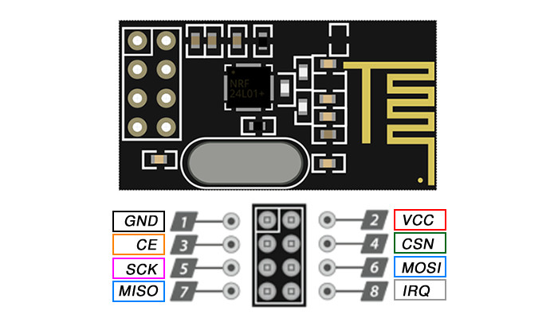

# Comunicação via NRF24L01

Conjunto de códigos Arduíno para realizar a comunicação sem fio usando módulos NRF24L01.

## Configurações

Para utilizar os módulos NRF24L01, é necessário instalar a biblioteca `RF24` no Arduino IDE. Para isso, vá em `Sketch > Include Library > Manage Libraries`, busque por `RF24` e instale a biblioteca desenvolvida por TMRh20.

No código, é importante que os microcontroladores tenham endereços únicos para evitar conflitos na comunicação. Certifique-se de definir endereços diferentes para cada dispositivo. No código, é possível encontrar o trecho:
```cpp
// Endereços para comunicação (devem ser iguais nos dois dispositivos, mas invertidos)
const byte addresses[][6] = {"00001", "00002"};

// Definir número do rádio (0 ou 1)
bool radioNumber = 1; // Índice do addresses do rádio (0 para o primeiro dispositivo, 1 para o segundo)
```

Em um dispositivo, defina `radioNumber` como `0`, e no outro, defina como `1`. Isso garantirá que cada dispositivo utilize o endereço correto para enviar e receber dados.

## Pinagem

A pinagem do módulo NRF24L01 com o Arduino segue a interface SPI. Abaixo está a pinagem padrão:

| NRF24L01 | Arduino |
|----------|---------|
| VCC      | 3.3V (**ATENÇÃO:** Não conectar a 5V)   |
| GND      | GND     |
| CE       | 9       |
| CSN      | 10      |
| SCK      | 13      |
| MOSI     | 11      |
| MISO     | 12      |
| IRQ      | Não conectado (opcional) |

Certifique-se de que o módulo NRF24L01 esteja alimentado com 3.3V, pois **a conexão a 5V pode danificar o módulo**. O pino `GND` sempre será visualmente identificável por um quadrado na base do pino (seja pintado ou pela forma da própria solda). As regras de pinagem são as mesmas para o módulo de antena inbutida e o de antena externa (PA/LNA). Ambas as versões foram utilizadas, e apresentam resultados similares até 32 m, mas o de antena externa consegue ir até 128 m sem conversor de tensão.



O adaptador de alimentação YL-105 ou HW-200 pode ser utilizado jonto com a versão LA/PNA (antena extendida) para fornecer a tensão correta ao módulo NRF24L01. Ele pode ser conectado à 5V e converte a tensão de 5V do Arduino para 3.3V, garantindo que o módulo funcione corretamente. 

_Obs: Neste estudo, quase todos os adaptadores comprados apresentavam falhas de funcionamento. (De 8 YL-105 comprados -- 2 em uma loja e 6 em outra -- apenas um conseguiu receber e transmitir, o resto dos 7 YL-105 e todos os 2 HM-200 só foram capazes de receber)_