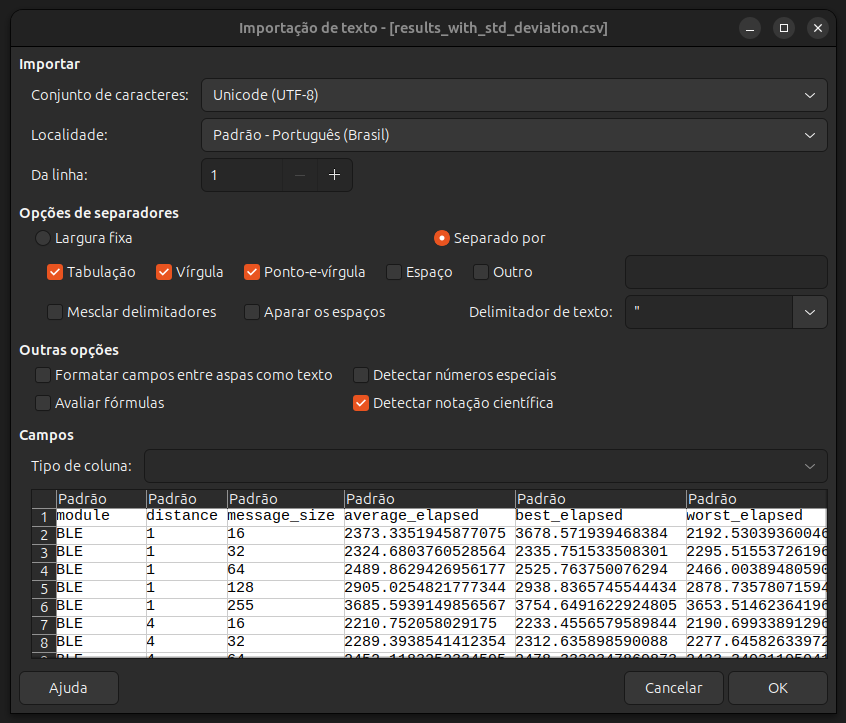
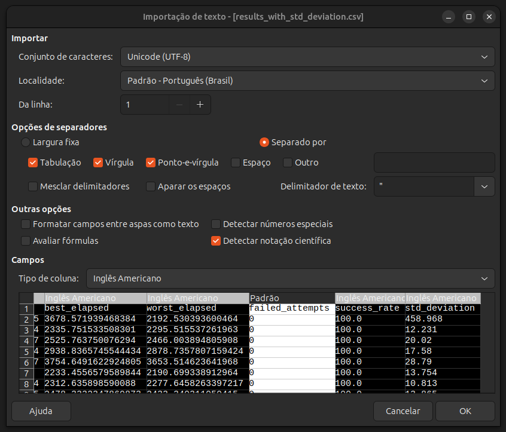

# Transmissor (o Ping do ping-pong) e processamento de dados

Este diretório possui duas funcionalidades: gerar os dados e processá-los em CSV.

## Transmissor e geração de dados

Este transmissor envia mensagens geradas aleatoriamente na porta definida pela variável `porta`, e espera o retorno da mesma mensagem. O código mede N envios para cada tamanho informado. Os parâmetros são definidos nas constantes.

```py
# Configurações
QTD_MEDICOES = 10
TIMEOUT = 15
INTERVAL_BETWEEN_MEASUREMENTS = 1
MESSAGE_SIZE = [16, 32, 64, 128, 255]  # Tamanhos de mensagem em bytes
MODULE_NAME = "MOME_MODULO"  # Nome do módulo de transmissão (NRF24L01_EXT, NRF24L01, LORA, RF, XBEE, BLE, BLUETOOTH)
TRANSMISSION_DISTANCE = 64  # Distância em metros
```

Aonde:
- `QTD_MEDICOES`: Quantidade de medições por tamanho
- `TIMEOUT`: tempo de espera máximo até o programa considerar o pacote como perdido
- `INTERVAL_BETWEEN_MEASUREMENTS`: intervalo entre medições para evitar colisões
- `MESSAGE_SIZE`: array com todos os tamanhos de mensagem. O código enviará a quantidade informada em `QTD_MEDICOES` para cada um dos tamanhos no array
- `MODULE_NAME`: Nome do módulo. Esta constante não afeta as medições, mas é usada para informar o módulo na hora da geração de resultados.
- `TRANSMISSION_DISTANCE`: Distância de transmissão em metros. Esta constante não afeta as medições, mas é usada para informar a distância na hora da geração de resultados.

Os resultados para cada tamanho são salvos como JSON e salvos na pasta do módulo e distância, seguindo o padrão `results/<MODULE_NAME>/<DISTANCE>m/<MESSAGE_SIZE>B.txt`. Exemplo: Os testes de 64 Bytes a 32 metros do `NRF24L01_EXT` serão salvos em `./results/NRF24L01_EXT/32m/64B.txt` conforme o seguinte formato.

```json
{
    // Informações de cabeçalho. Constantes em todos os testes dentro da pasta `results/NRF24L01_EXT/32m`
    "module": "NRF24L01_EXT",
    "distance": 32,
    "message_sizes": [
        16,
        32,
        64,
        128,
        255
    ],
    "timeout": 15,
    "interval": 1,
    "results": {
        // Resultados específicos para este tamanho
        "message_size": 64,
        "average_elapsed": 2358.889389038086,
        "best_elapsed": 2362.2653484344482,
        "worst_elapsed": 2354.4352054595947,
        "failed_attempts": 0,
        "success_rate": 100.0,
        "measurements": [
            2358.0636978149414,
            2358.994722366333,
            2359.1530323028564,
            2360.6834411621094,
            2359.618902206421,
            2360.5873584747314,
            2362.2653484344482,
            2358.8576316833496,
            2354.4352054595947,
            2356.234550476074
        ]
    }
}
```

_Obs: Os campos `best_elapsed` e `worst_elapsed` representam o melhor e o pior tempo de resposta, respectivamente. Entretanto, por se tratar de latência, o menor deveria ser o "melhor" e vice versa, mas encontra-se invertido. Este erro só foi percebido depois de gerar todos os resultados, por isso foi mantido._

### Como rodar o transmissor?

Para rodar, navegue com o terminal até este diretório e rode o seguinte comando

```sh
sudo ./runPing.sh
```

Qualquer mensagem recebida ou erro de recebimento serão exibidos no terminal. Por ser o código de comportamento "ativo", os dados são apresentados de forma mais elaborada. Serão exibidas informações de tempo de espera, número de envios, mensagem recebida, sucesso ou erro e resumo da rodada para cada tamanho, bém como o nome de cada arquivo gerado.

## Geração de CSV

Existem dois códigos de geração de .csv, mas o `standarDeviation.py` é usado de forma definitiva, por fazer o mesmo que o `processResults.py`, mas com informação de desvio padrão e ordenado de forma correta.

Para gerar o .csv, navegue com o terminal até este diretório e rode o seguinte comando

```sh
sudo ./runProcess.sh
```

O resultado é guardado em `./processed_results/results_with_std_deviation.csv`. Para abrí-lo corretamente com LibreOffice, é necessário usar a opção "Importar texto" e selecionar o delimitador correto (padrão é vírgula). Clique no CSV e esta janela irá abrir



Com CTRL + Click, selecione todas as colunas que contenham dados com ponto flutuante e no campo `Tipo de coluna`, mudar para "Inglês Americano".



Após isso, clique em `OK`. Agora os números com ponto flutuante podem ser corretamente formatados.